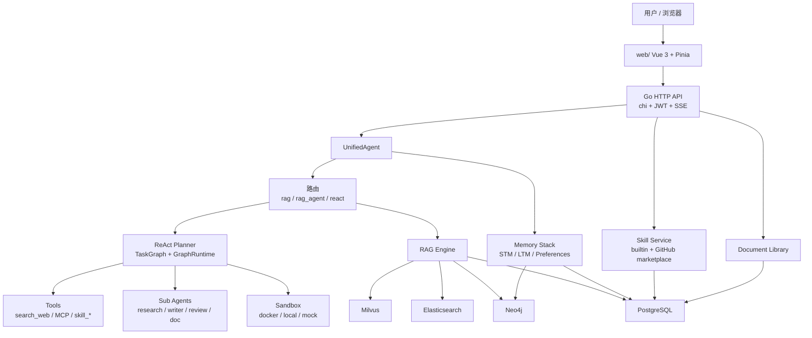
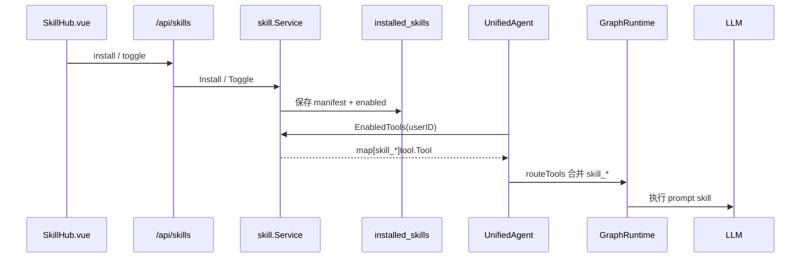

# AGI-saber

agi时代的个人办公智能助手

后端是 `cmd/server/main.go`，提供认证、SSE 对话、知识库、记忆、工具、Skill、文档库和状态接口；前端在 `web/`，使用 Vite + Vue 3 + Pinia。后端不再托管前端静态文件，开发时分别启动。

## 当前能力

- 账号体系：注册、登录、JWT 鉴权；除健康检查和登录注册外，业务接口都需要 token。
- 流式对话：`/api/chat/stream` 使用 SSE 推送 route、step、token、done 等事件。
- ReAct 图执行：Planner 生成任务图，GraphRuntime 支持并行执行、竞速、重试、快照和失败后 replan。
- RAG 知识库：支持文本、PDF 等文档上传；Milvus 语义检索、Elasticsearch BM25、Neo4j 图检索可用时会融合，不可用时降级。
- 三层记忆：短期会话、长期记忆、用户偏好；长期记忆带合并、去重、衰减、隔离和 superseded 查询。
- 子 Agent：`research_agent`、`writer_agent`、`review_agent`、`doc_agent`，用于知识增强报告和文档保存流水线。
- 文档库：可写入 Markdown 文档、查询文档、删除/重新入库 RAG。
- 工具系统：内置 `search_web`，支持 MCP HTTP 工具注册；普通对话默认进入 ReAct loop。
- Skill 广场：内置办公 prompt skill，支持从 GitHub 搜索结果安装 prompt skill。
- 沙箱产物：支持 Docker / local / mock 后端，为复杂任务准备宿主机产物目录。
- 基础设施降级：PostgreSQL、Milvus、Elasticsearch、Kafka、Neo4j 均按连接状态降级；核心服务可启动，但部分能力会受限。

> 注意：GitHub Skill 当前不会下载或执行仓库代码。它只是把 GitHub 仓库名称和描述包装成一个 prompt skill，再由本地 LLM 完成任务。

## 架构概览



## 技术栈

- Backend: Go 1.24, chi, JWT, PostgreSQL driver, Milvus SDK, Elasticsearch client, Neo4j driver, Kafka client.
- Frontend: Vue 3, Vite, Pinia.
- Infra: PostgreSQL, Milvus + etcd + MinIO, Elasticsearch, Kafka KRaft, Neo4j.
- LLM API: OpenAI-compatible chat endpoint; 默认配置示例使用智谱 API 地址。

## 快速开始

### 1. 准备环境

建议版本：

- Go 1.24+
- Node.js 18+
- Docker Desktop / Docker Engine

### 2. 配置密钥

后端启动强制要求 `JWT_SECRET` 至少 32 字节：

```bash
export JWT_SECRET="replace-with-at-least-32-bytes-secret"
```

可选环境变量：

```bash
export GITHUB_TOKEN="ghp_xxx"      # Skill 广场搜索 GitHub 时提额，可不填
export PPROF_ADMIN_TOKEN="xxx"     # 仅 observability.pprof.enabled=true 时需要
```

然后按需编辑 [config/config.yaml](config/config.yaml)：

- `llm.api_url` / `llm.api_key` / `llm.model`
- `llm.fast_model`
- `embedding.api_url` / `embedding.api_key` / `embedding.model`
- `search.api_key` / `search.api_url`
- `skillhub.enabled` / `skillhub.keyword`
- `sandbox.backend` / `sandbox.artifact_host_dir`

配置文件里的 `"."` 只是占位符。因为非空字符串会被视为“已配置真实 API”，如果不替换，LLM 请求会失败后降级 mock。

### 3. 启动基础设施

```bash
docker compose up -d
```

会启动：

- PostgreSQL: `localhost:5432`
- Milvus: `localhost:19530`
- Elasticsearch: `localhost:9200`
- Kafka: `localhost:29092`
- Neo4j: `localhost:7474` / `localhost:7687`

只想跑最小后端也可以不启动这些服务；系统会降级，但登录、安装 Skill、持久化记忆等依赖 PostgreSQL 的能力会不可用。

### 4. 启动后端

```bash
go mod download
go run ./cmd/server
```

默认监听：

```text
http://localhost:8090
```

健康检查：

```bash
curl http://localhost:8090/healthz
curl http://localhost:8090/readyz
```

### 5. 启动前端

```bash
cd web
npm install
npm run dev
```

访问：

```text
http://localhost:5173
```

`web/vite.config.js` 会把 `/api`、`/healthz`、`/readyz` 代理到 `http://localhost:8090`。

## 常用命令

```bash
# 后端测试
go test ./...

# 前端构建
cd web && npm run build

# 前端本地预览生产包
cd web && npm run preview

# 停止基础设施
docker compose down

# 停止并删除数据卷
docker compose down -v
```

## 使用流程

1. 打开前端，注册或登录账号。
2. 普通聊天默认进入 `react` 模式，由 Planner 判断是否需要调用工具或 skill。
3. 打开知识库开关后：
   - 普通问答走 `rag`。
   - 报告、方案、总结、文档类意图走 `rag_agent`，触发 research -> writer -> review -> doc 流水线。
4. 在 Skill 广场安装 skill 后，需要在“已安装”区域打开开关，才会参与主循环。
5. 上传文档后可用于 RAG；由 doc_agent 保存的报告也可自动写入文档库并入库 RAG。

## Skill 机制

Skill 的领域模型在 `internal/domain/skill`，应用服务在 `internal/application/skill`。

当前支持两类调用：

- `prompt`：把 skill 的 `PromptTemplate` 渲染成 LLM 请求。内置办公 skill 和 GitHub skill 目前都走这类。
- `mcp`：复用外部 HTTP MCP 工具调用，当前作为扩展路径保留。

安装与调用链：



边界说明：

- GitHub Skill 不执行仓库代码，只把仓库描述作为背景资料注入 prompt。
- Skill 只有 `enabled=true` 时才会进入当前用户的 `routeTools`。
- RAG 简单问答模式不会合并 Skill；普通 `react` loop 才会合并 Skill。
- skill 节点属于 LLM 型工具，GraphRuntime 会放宽单步超时，避免 5 秒默认工具超时误杀。

## API 摘要

公开接口：

| Method | Path | 说明 |
| --- | --- | --- |
| `POST` | `/api/auth/register` | 注册并返回 token |
| `POST` | `/api/auth/login` | 登录并返回 token |
| `GET` | `/healthz` | 存活检查 |
| `GET` | `/readyz` | 就绪检查 |

需要 `Authorization: Bearer <token>`：

| Method | Path | 说明 |
| --- | --- | --- |
| `GET` | `/api/auth/me` | 当前用户 |
| `POST` | `/api/chat` | 同步对话 |
| `POST` | `/api/chat/stream` | SSE 流式对话 |
| `POST` | `/api/chat/cancel` | 取消当前请求 |
| `POST` | `/api/upload` | 上传文件或文本入库 RAG |
| `POST` | `/api/docs/delete` | 删除 RAG 文档 chunks |
| `GET` | `/api/documents/` | 文档库列表 |
| `POST` | `/api/documents/` | 写入文档库 |
| `GET` | `/api/documents/{documentID}` | 获取文档 |
| `POST` | `/api/documents/{documentID}/ingest` | 文档重新入库 RAG |
| `GET` | `/api/memory/` | 记忆快照 |
| `GET` | `/api/memory/quarantined` | 被隔离记忆 |
| `POST` | `/api/memory/quarantine` | 隔离记忆 |
| `POST` | `/api/memory/unquarantine` | 解除隔离 |
| `GET` | `/api/memory/superseded` | 被替代记忆 |
| `GET` | `/api/tools` | 当前全局工具列表 |
| `POST` | `/api/tools/mcp` | 注册 MCP HTTP 工具 |
| `GET` | `/api/skills/marketplace` | Skill 广场 |
| `GET` | `/api/skills/installed` | 当前用户已安装 Skill |
| `POST` | `/api/skills/install` | 安装 Skill |
| `POST` | `/api/skills/uninstall` | 卸载 Skill |
| `POST` | `/api/skills/toggle` | 开关 Skill |
| `GET` | `/api/snapshots` | ReAct 任务快照 |
| `GET` | `/api/status` | 服务状态 |

SSE 事件类型主要包括：

- `start`
- `route`
- `memory`
- `graph_ready`
- `node_start`
- `node_done`
- `step`
- `sandbox_ready`
- `rag_result`
- `token`
- `done`

## 目录结构

```text
.
├── cmd/server/                 # 后端入口
├── config/                     # YAML 配置加载与默认值
├── internal/
│   ├── application/
│   │   ├── auth/               # 注册、登录、JWT 应用服务
│   │   ├── chat/               # UnifiedAgent、ReAct、RAG 路由、子 Agent、文档库
│   │   └── skill/              # Skill 广场应用服务
│   ├── domain/                 # 领域模型：tool / skill / rag / memory / document / sandbox
│   ├── infrastructure/         # LLM、持久化、平台连接、skillhub、工具实现
│   ├── interfaces/http/        # chi handler + middleware
│   ├── pkg/logger/             # slog 封装
│   └── usercontext/            # userID context helpers
├── web/                        # Vue 3 前端
├── docs/                       # 架构文档和示例 skill 文档
├── docker-compose.yml          # 本地基础设施
├── Dockerfile                  # 后端镜像
└── go.mod
```

## 数据与持久化

PostgreSQL 会保存：

- 用户和密码哈希
- 聊天历史
- 用户偏好
- 长期记忆
- RAG chunks 元数据
- 文档库
- task snapshots
- installed skills

Milvus 保存向量索引，Elasticsearch 保存 BM25 索引，Neo4j 保存知识图谱和图增强记忆，Kafka 用于事件发布。

如果某个基础设施连接失败，启动不会整体失败，但相关能力会降级。例如 PostgreSQL 不可用时，登录注册、Skill 安装、记忆和文档持久化会失败或不可用。

## 配置重点

| 配置 | 说明 |
| --- | --- |
| `server.port` | 后端监听端口，默认 `8090` |
| `auth.jwt_secret` | JWT 密钥，生产必须用环境变量注入 |
| `llm.model` | 最终回答模型 |
| `llm.fast_model` | Planner、参数抽取、子 Agent、RAG 改写等内部步骤模型 |
| `embedding.model` | RAG 和记忆用向量模型 |
| `rag.rag_milvus_dim` | Milvus 向量维度，需和 embedding 模型一致 |
| `harness.step_timeout_ms` | 普通工具单步超时 |
| `graph_runtime.max_parallel` | 图执行最大并行节点数 |
| `sandbox.backend` | `docker` / `local` / `mock` |
| `sandbox.artifact_host_dir` | 任务产物输出目录 |
| `skillhub.enabled` | 是否启用 GitHub Skill 广场 |
| `skillhub.keyword` | GitHub 搜索关键词，多词是 AND |

## 部署说明

后端 Dockerfile 只打包 Go API。前端需要独立构建并由 nginx 或静态服务器托管：

```bash
cd web
npm run build
```

生产部署建议：

- 前端静态站点托管 `web/dist/`。
- nginx 将 `/api`、`/healthz`、`/readyz` 反代到后端。
- 不要提交真实 API Key、JWT_SECRET、GitHub Token。
- 如果开启 pprof，必须设置 `PPROF_ADMIN_TOKEN`，并限制访问来源。

`web/nginx.conf.example` 提供了反代示例。

## 常见问题

**打开 `http://localhost:8090` 只有一句 API 提示？**

正常。后端不再托管前端，请启动 `web/` 的 Vite dev server 或部署 `web/dist/`。

**业务接口返回 401？**

除 `/api/auth/register`、`/api/auth/login`、`/healthz`、`/readyz` 外都需要 JWT。前端登录后会自动注入 token。

**Skill 安装了但不调用？**

安装后还要在已安装列表打开开关。并且只有普通 `react` loop 会合并 Skill，RAG 简单问答不会合并。

**GitHub Skill 没有真实插件能力？**

这是当前设计边界。GitHub Skill 只是 prompt 包装，不会 clone 仓库、不会执行仓库代码。

**LLM 一直降级 mock？**

检查 `llm.api_key`、`llm.api_url`、模型名和网络。配置里的 `"."` 是占位符，会触发真实请求但通常失败。

**RAG 结果不准或 Milvus 报维度错误？**

确认 `rag.rag_milvus_dim` 与 embedding 模型输出维度一致，并在变更维度后清理旧 Milvus collection / 数据卷。

## 测试状态

当前可用：

```bash
go test ./...
```

前端目前没有独立单元测试脚本，至少应运行：

```bash
cd web
npm run build
```

## 许可证

仓库当前未声明开源许可证。对外发布或商用前请先补充 LICENSE。
