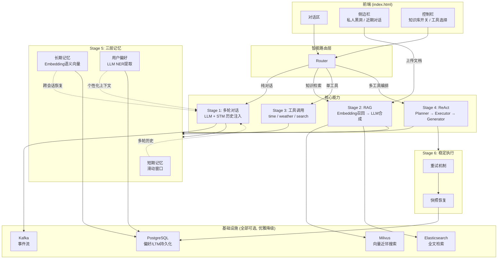
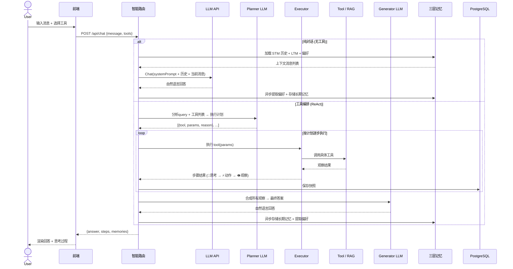

# AGI-assistant：多模态智能体系统

AGI-assistant 是一个面向个人与企业的多模态智能体系统，融合了检索增强生成（RAG）、三层记忆、知识图谱、工具链与可恢复执行流，支持多轮对话、知识检索、工具调用与复杂推理。系统具备高可用性、可扩展性与工程落地能力。

## 项目特性

- **多阶段智能体核心**：支持纯对话、RAG 检索、单工具调用、多工具编排（ReAct）等多种智能体模式，自动路由。
- **RAG 检索增强生成**：融合 Milvus 语义向量、Elasticsearch 关键词、Neo4j 知识图谱，RRF 融合排序，自动降级，支持文档分块与异步实体关系抽取。
- **三层记忆系统**：短期记忆（滑动窗口）、长期记忆（Embedding/TF）、用户偏好（LLM+规则），支持去重、合并、衰减、过期淘汰。
- **图增强记忆**：长期记忆叠加 Neo4j 图层，支持 FOLLOWS、SIMILAR_TO、CAUSES、BELONGS_TO 等关系，提升历史联想与推理能力。
- **工具链与可恢复执行**：内置时间、天气、搜索、RAG 检索等工具，支持 ReAct 规划-执行-生成流程，任务快照与重试机制保障稳定性。
- **高可用基础设施**：PostgreSQL 持久化、Milvus/ES/Neo4j 可选，自动优雅降级，适配多种部署环境。

---

## 整体架构图

## 核心流程时序图

## 记忆系统详细流程图

---

## 技术实现亮点

- **RAG 检索增强**：
    - 支持多模态混合检索（Milvus 语义向量、ES 关键词、Neo4j 知识图谱），RRF 融合排序。
    - 文本分块采用窗口重叠，提升召回覆盖率。
    - 检索模式自动切换，支持企业级高可用。
    - 检索结果结构化，便于 LLM 合成与追溯。

- **三层记忆系统**：
    - 短期记忆：滑动窗口保存最近 N 轮对话。
    - 长期记忆：Embedding/TF 双层，支持去重、合并、衰减、过期淘汰。
    - 偏好记忆：LLM+规则自动提取用户偏好，持久化跨会话恢复。

- **图增强记忆**：
    - 记忆写入时自动建立时序（FOLLOWS）、相似（SIMILAR_TO）等关系。
    - 支持图扩展召回，发现间接关联历史记忆。
    - 合并淘汰时保护高中心度节点，防止核心知识丢失。

- **智能体与工具链**：
    - 路由优先级：ReAct 复合推理 > 单工具 > RAG 检索 > 纯对话。
    - 工具链支持自定义扩展，RAG 检索作为知识库工具无缝集成。
    - ReAct 规划-执行-生成流程，任务快照与重试机制保障稳定性。

- **工程与基础设施**：
    - PostgreSQL 持久化所有关键数据。
    - Milvus/ES/Neo4j 可选，自动降级，适配多种部署环境。
    - 前后端解耦，支持多端接入。

---

## 快速开始

1. 安装依赖：`go mod tidy`
2. 配置数据库与基础设施（可选：Milvus/ES/Neo4j）
3. 启动后端：`go run main.go`
4. 访问 frontend/index.html 体验前端

---

## 目录结构简述

- final/internal/agent/      —— 智能体核心与调度
- final/internal/rag/        —— RAG 检索增强生成引擎
- final/internal/memory/     —— 三层记忆系统与图增强
- final/internal/graph/      —— 知识图谱与实体关系抽取
- final/internal/tools/      —— 工具链与扩展
- final/internal/llm/        —— LLM/Embedding 接口
- final/internal/infra/      —— 基础设施适配
- frontend/                  —— 前端页面

---

## 致谢

本项目受多模态智能体、RAG、知识图谱、记忆增强等前沿研究启发，欢迎交流与合作。

```mermaid
sequenceDiagram
    actor User
    participant Agent as Agent
    participant STM as 短期记忆<br/>(滑动窗口 N×2)
    participant LLM as LLM API
    participant EMB as Embedding API
    participant LTM as 长期记忆<br/>(Embedding+TF双层)
    participant PREF as 用户偏好<br/>(LLM NER+规则双重)
    participant PG as PostgreSQL

    Note over User,PG: ═══════════ 服务启动: 跨会话恢复 ═══════════
    Agent->>PG: LoadPreferences(userID)
    PG-->>Agent: 历史偏好 [{key, value}, ...]
    Agent->>PREF: SaveBatch(恢复偏好到内存)
    Agent->>PG: LoadLongTermItems()
    PG-->>Agent: 历史LTM [{id, content, embedding, importance}, ...]
    Agent->>LTM: StoreItem(逐条恢复到内存索引)
    Note right of LTM: 重建TF词表<br/>恢复Embedding向量
    Agent->>STM: 初始化空窗口
    Note right of STM: 上一会话的STM随进程消亡<br/>不跨会话恢复

    Note over User,PG: ═══════════ 每轮对话: 读取阶段 ═══════════
    User->>Agent: "你好，我叫小明，我喜欢打篮球"
    Agent->>STM: Add(user, 消息)
    Note right of STM: 窗口 > MaxTurns×2 时<br/>自动淘汰最早消息

    Agent->>LTM: Recall(query, topK=3, queryEmbedding?)
    alt Embedding API 可用
        Agent->>EMB: Embed(query)
        EMB-->>LTM: query向量
        loop 遍历所有LTM条目
            LTM->>LTM: cosine(queryEmb, itemEmb)
            LTM->>LTM: score = sim×0.7 + importance×0.3
            alt score ≥ 0.4 阈值
                LTM->>LTM: 更新item.LastAccessed
                LTM->>LTM: 加入候选集
            else score < 0.4
                Note right of LTM: 过滤噪声，不注入
            end
        end
    else 降级: TF词袋
        LTM->>LTM: buildVocab(query) 扩充词表
        LTM->>LTM: textToVector(query) → TF向量
        loop 遍历所有LTM条目
            LTM->>LTM: cosine(queryTF, itemTF)
            LTM->>LTM: score = sim×0.7 + importance×0.3
        end
    end
    LTM-->>Agent: 召回记忆 [{content, score}, ...] (按score降序)

    Agent->>PREF: BuildContext()
    PREF-->>Agent: "【用户偏好】\n姓名: 小明\n喜好: 篮球"

    Agent->>LLM: Chat(systemPrompt + 偏好上下文 + LTM记忆 + STM全量历史 + 当前消息)
    LLM-->>Agent: "你好小明！喜欢篮球很棒..."

    Note over User,PG: ═══════════ 每轮对话: 写入阶段 ═══════════
    Agent->>STM: Add(assistant, 回答内容)

    Agent->>LTM: Store(用户消息, importance, embedding?)
    alt Embedding API 可用
        Agent->>EMB: Embed(消息内容)
        EMB-->>LTM: 语义向量
        loop 去重检测: vs 每条已有条目
            LTM->>LTM: cosine(newEmb, itemEmb)
            alt sim ≥ 0.95 (去重阈值)
                LTM->>LTM: 更新已有条目重要性+访问时间
                Note right of LTM: 跳过存储，返回false
            else sim < 0.95
                LTM->>LTM: 新增条目
            end
        end
        LTM->>PG: SaveLongTermItem(content, vector, importance)
    else 降级: TF词袋
        LTM->>LTM: buildVocab + textToVector
        LTM->>PG: SaveLongTermItem(content, nil, importance)
    end

    par 异步: LLM NER偏好提取
        Agent->>LLM: "从以下对话提取用户偏好: ..."
        LLM-->>Agent: {"姓名":"小明","喜好":"篮球"}
        Agent->>PREF: SaveBatch(kvs)
        PREF->>PG: SavePreference(key, value)
    and 同步: 规则兜底 (立即生效)
        Agent->>PREF: ExtractAndSave("我喜欢打篮球")
        Note right of PREF: 规则: "我喜欢" → key=喜好<br/>规则: "我叫" → key=姓名<br/>规则: "我爱" → key=喜好
        PREF-->>Agent: key="喜好", value="打篮球", ok=true
        PREF->>PG: SavePreference(key, value)
    end

    Note over User,PG: ═══════════ 合并触发: 每5条新记忆 ═══════════
    LTM->>LTM: NeedConsolidation()?
    alt storeCount ≥ TriggerInterval(5)
        Note over LTM: Phase 1: 重要性衰减
        LTM->>LTM: importance × DecayRate^days<br/>(每日×0.995, 30天≈0.86)
        Note over LTM: Phase 2: 去重 + 合并
        loop 两两比较相似度
            alt sim ≥ 0.95 (DedupThreshold)
                LTM->>LTM: 保留importance更高的<br/>删除另一条
                LTM->>PG: DELETE removed IDs
            else sim ≥ 0.80 (SimilarityThreshold)
                LTM->>LTM: mergeItems(): 内容拼接/保留较长<br/>Embedding按importance加权平均
                LTM->>PG: UPDATE merged item<br/>DELETE被合并条目
            end
        end
        Note over LTM: Phase 3: 过期淘汰
        loop 检查每条记忆
            alt days > TTL(30) AND importance < Min(0.3)
                LTM->>LTM: 删除过期条目
                LTM->>PG: DELETE expired IDs
            end
        end
        LTM->>LTM: rebuildVocab() 重建词表
    end

    Note over User,PG: ═══════════ 会话结束 ═══════════
    Note right of STM: 进程消亡, STM清除<br/>不持久化（设计如此）
    Note right of LTM: 已实时持久化到PG<br/>Consolidation结果已同步
    Note right of PREF: 已实时持久化到PG<br/>下次启动LoadPreferences恢复
```

