# 长期记忆更改涉及多库时的最终一致性方案

## 1. 背景与目标

长期记忆同时服务于结构化持久化、语义向量召回和图关系召回，因此一条记忆的新增、修改、合并或删除会影响多个存储：

- PostgreSQL：保存长期记忆的完整业务状态和审计关系；
- 进程内 LongTerm：提供低延迟的本机读取、去重和计算能力；
- Milvus：保存向量及其检索元数据，提供语义召回；
- Neo4j：保存记忆节点和关系边，提供图扩展召回。

本方案的目标不是让这些存储参与分布式强事务，而是明确唯一事实源，并通过事务型 Outbox、幂等投影、版本控制和周期对账，使所有派生存储在有限时间内收敛到 PostgreSQL 的状态。

一致性边界如下：

| 范围 | 一致性级别 |
|---|---|
| `long_term_memory` 与 `memory_outbox` | PostgreSQL 本地事务强一致 |
| PostgreSQL 与本机 LongTerm | 提交后立即刷新，失败时失效并重载 |
| PostgreSQL 与 Milvus | 最终一致 |
| PostgreSQL 与 Neo4j | 最终一致 |
| 管理、审计接口 | 始终以 PostgreSQL 为准 |

## 2. 改造前的状况

当前写入链路近似为：

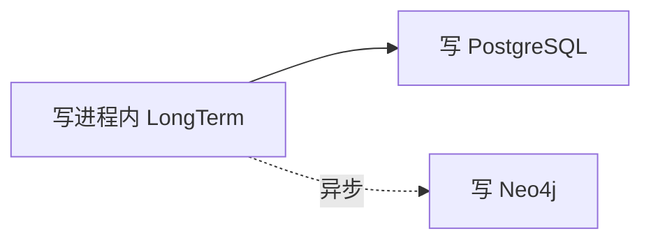

当前实现偏向可用性优先的弱一致模型，主要存在以下问题。

### 2.1 内存先于持久化成功

新记忆先进入进程内 LongTerm，然后才写 PostgreSQL。如果 PostgreSQL 写入失败：

- 当前进程仍可能召回这条记忆；
- 进程重启后该记忆消失；
- 没有可靠的补偿任务将其重新持久化；
- 日志和业务返回可能无法准确反映持久化结果。

### 2.2 Neo4j 更新是尽力而为

Neo4j 节点和边由后台 goroutine 异步更新。失败时主要记录日志，没有持久化的待办任务、重试状态或死信机制。因此一次临时故障可能形成长期漂移。

### 2.3 临时 ID 与正式 ID 存在竞争窗口

内存写入时会先产生本地 ID，PostgreSQL 插入成功后再获得数据库 ID。Neo4j 可能已使用本地 ID 建立节点或关系，随后又用 PostgreSQL ID 创建节点，导致重复节点、孤儿节点或错误关系。

### 2.4 合并操作存在部分提交

现有合并通常先改变进程内 LongTerm，再依次执行 PostgreSQL 删除、内容更新和重要性衰减。这些数据库操作没有组成一个完整事务，任何一步失败都可能产生：

- 内存已经删除，PostgreSQL 仍保留；
- PostgreSQL 已删除被合并记录，但保留记录尚未更新；
- Neo4j 已删除节点，PostgreSQL 删除失败；
- 重启后旧状态从 PostgreSQL 重新出现。

### 2.5 缺少版本与乱序保护

派生存储没有统一保存长期记忆版本。异步操作一旦重试或乱序，旧更新可能覆盖新状态，旧删除也可能误删已经重新写入的新版本。

### 2.6 缺少持续对账

系统没有周期性比较 PostgreSQL、Milvus 和 Neo4j 的数据状态。历史失败、人工改库或程序缺陷造成的缺失、孤儿及陈旧数据无法自动修复。

## 3. 核心设计原则

### 3.1 PostgreSQL 是唯一事实源

只有 PostgreSQL 中已提交的 `long_term_memory` 状态才是权威状态。进程内 LongTerm、Milvus 和 Neo4j 都是可失效、可重建的派生视图，不参与业务事实裁决。

“LongTerm/PG 作为 Source of Truth”应严格解释为：

- PostgreSQL 是 Source of Truth；
- LongTerm 是 PostgreSQL 的本机缓存和计算工作副本；
- 缓存状态与 PostgreSQL 冲突时，无条件以 PostgreSQL 为准。

### 3.2 先提交事实，再更新投影

所有新增、修改、删除和合并先在 PostgreSQL 事务中提交。事务成功后才允许刷新进程内 LongTerm，并由后台 worker 更新 Milvus 和 Neo4j。

### 3.3 Outbox 与业务变化同事务

任何需要传播到派生存储的变化，必须在修改 `long_term_memory` 的同一个 PostgreSQL 事务里写入 `memory_outbox`。这样不会出现“业务状态已提交，但同步消息永久丢失”的窗口。

### 3.4 至少一次投递，幂等消费

Worker 使用至少一次语义消费 outbox。事件可以被重复领取、重复发送和重复执行，但目标端结果必须保持不变。

### 3.5 版本防止旧操作覆盖新状态

每条记忆维护单调递增的 `version`。所有 outbox 事件和派生对象携带相同版本，目标端只接受不早于当前状态的操作。

### 3.6 对账是最后安全网

Outbox 解决正常写入链路的可靠传播；reconciliation 解决历史缺陷、人工操作、目标库数据损坏以及极端情况下的漏同步。两者缺一不可。

## 4. 改造后的总体架构

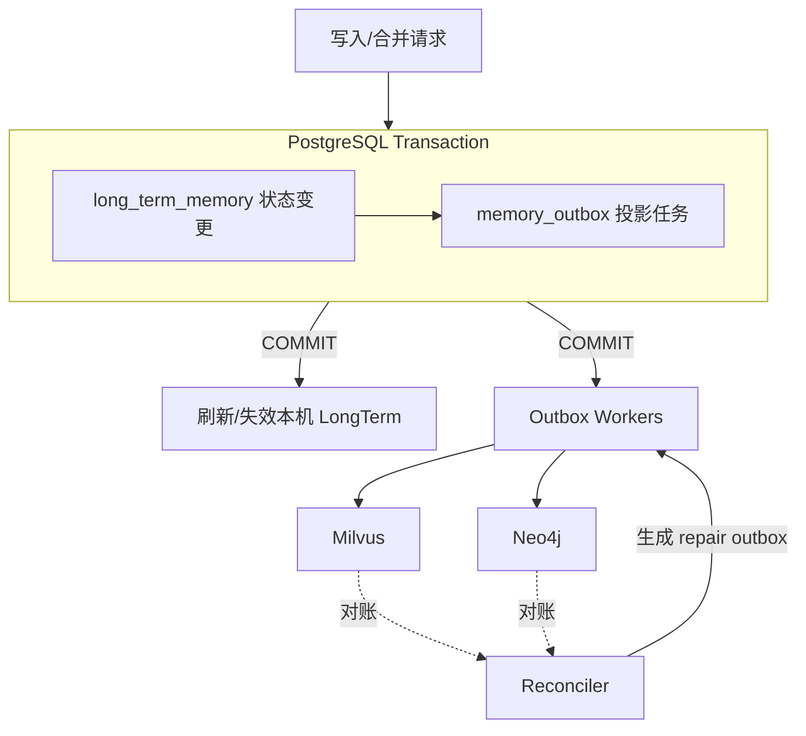

正常写入流程：

1. 根据请求计算候选变化，但不修改共享 LongTerm；
2. 开启 PostgreSQL 事务；
3. 新增或更新 `long_term_memory`，由 PostgreSQL 生成正式 `memory_id`；
4. 在同一事务中写入对应的 `memory_outbox` 记录；
5. 提交事务；
6. 提交成功后刷新当前实例的 LongTerm，实现 read-your-writes；
7. 后台 worker 幂等投影到 Milvus 和 Neo4j；
8. Reconciler 周期性发现并修复缺失、孤儿和陈旧数据。

若步骤 5 失败，业务状态与 outbox 一起回滚，不更新任何缓存或派生库。若步骤 6 以后失败，PostgreSQL 事实不受影响，系统通过缓存重载、outbox 重试或 reconciliation 最终收敛。

## 5. PostgreSQL 数据模型

### 5.1 long_term_memory

现有表建议增加以下字段：

```sql
ALTER TABLE long_term_memory
    ADD COLUMN version BIGINT NOT NULL DEFAULT 1,
    ADD COLUMN updated_at TIMESTAMPTZ NOT NULL DEFAULT NOW(),
    ADD COLUMN deleted_at TIMESTAMPTZ,
    ADD COLUMN content_hash TEXT NOT NULL DEFAULT '';
```

字段含义：

- `version`：每次影响派生状态的修改都加一；
- `updated_at`：业务状态最后更新时间；
- `deleted_at`：软删除墓碑；
- `content_hash`：规范化投影内容的摘要，用于快速对账。

删除优先采用软删除。若直接物理删除，Reconciler 无法仅凭 PostgreSQL 判断目标库中的对象是应保留数据还是孤儿。墓碑应至少保留到超过 outbox 最大重试周期和 reconciliation 最大间隔；例如保留 30 天，再由独立清理任务物理删除。

`content_hash` 应基于所有会影响 Milvus/Neo4j 投影的规范化字段计算，例如：

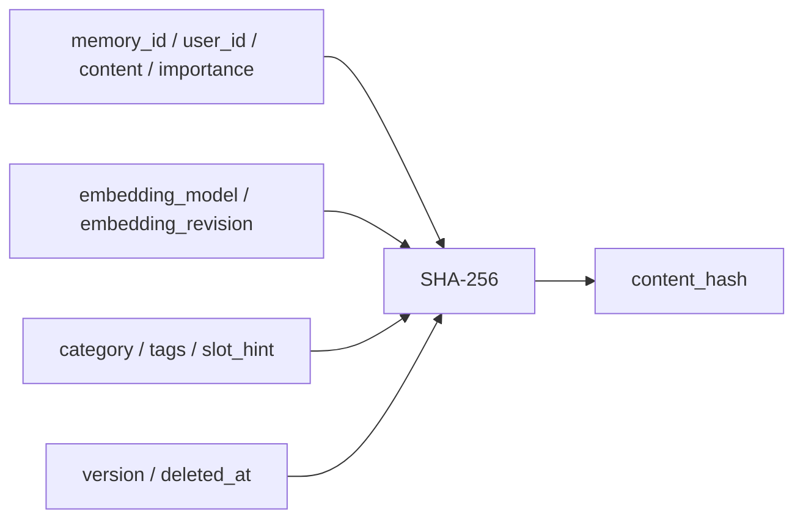

### 5.2 memory_outbox

```sql
CREATE TABLE memory_outbox (
    id                BIGSERIAL PRIMARY KEY,
    event_id          UUID NOT NULL UNIQUE,
    aggregate_id      BIGINT NOT NULL,
    user_id           TEXT NOT NULL,
    aggregate_version BIGINT NOT NULL,
    event_type        TEXT NOT NULL,
    target            TEXT NOT NULL,
    payload           JSONB NOT NULL,
    status            TEXT NOT NULL DEFAULT 'pending',
    attempts          INT NOT NULL DEFAULT 0,
    available_at      TIMESTAMPTZ NOT NULL DEFAULT NOW(),
    locked_at         TIMESTAMPTZ,
    locked_by         TEXT,
    processed_at      TIMESTAMPTZ,
    last_error        TEXT,
    created_at        TIMESTAMPTZ NOT NULL DEFAULT NOW(),
    CONSTRAINT memory_outbox_status_check
        CHECK (status IN ('pending', 'processing', 'processed', 'dead')),
    CONSTRAINT memory_outbox_target_check
        CHECK (target IN ('milvus', 'neo4j', 'ltm_cache'))
);

CREATE INDEX idx_memory_outbox_ready
    ON memory_outbox (available_at, id)
    WHERE status = 'pending';

CREATE INDEX idx_memory_outbox_stale_lock
    ON memory_outbox (locked_at)
    WHERE status = 'processing';

CREATE INDEX idx_memory_outbox_aggregate
    ON memory_outbox (aggregate_id, aggregate_version);
```

推荐的事件类型为：

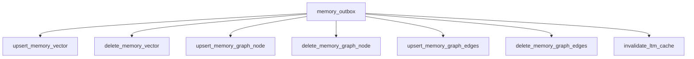

原定的 `update_memory_graph_node` 应改为 `upsert_memory_graph_node`，使新增和更新成为同一种幂等操作。Neo4j 的关系边必须纳入同步范围；只同步节点不能保证图召回完整收敛。

第一阶段使用上述“面向目标库的命令型事件”可以降低改造成本。未来若增加更多投影，可演进为 `memory_created`、`memory_updated`、`memory_deleted`、`memory_merged` 等领域事件，并为各投影维护独立消费进度。

### 5.3 Outbox payload

Upsert 事件应尽量携带投影所需的完整状态，而不是只携带变化字段：

```json
{
  "memory_id": 123,
  "user_id": "user-1",
  "version": 7,
  "content": "用户喜欢咖啡",
  "importance": 0.82,
  "embedding": [0.1, 0.2],
  "embedding_model": "text-embedding-model",
  "embedding_revision": "2026-07",
  "category": "preference",
  "tags": ["preference", "src:user"],
  "slot_hint": "profile",
  "content_hash": "..."
}
```

完整状态使 worker 无需拼接多个历史事件，也便于安全重试和人工重放。若 embedding 体积使 outbox 膨胀过快，payload 可只保存 `memory_id`、`version` 和 hash，由 worker 从 PostgreSQL读取当前完整状态；但 worker 必须处理“事件版本已落后于当前 PG 版本”的情况。

## 6. 写入与更新事务

新增记忆的事务步骤：

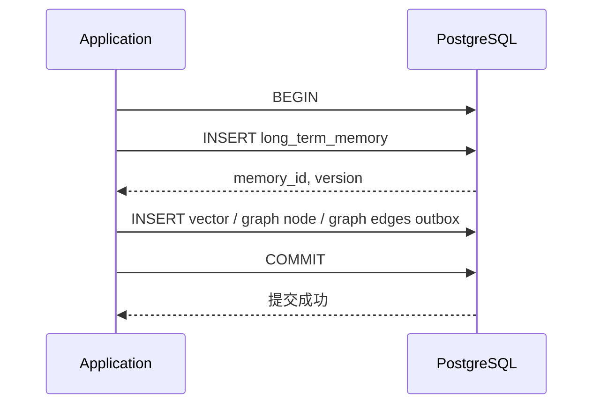

更新记忆时使用乐观锁：

```sql
UPDATE long_term_memory
SET content = $1,
    importance = $2,
    version = version + 1,
    updated_at = NOW(),
    content_hash = $3
WHERE id = $4
  AND version = $5
RETURNING version;
```

影响行数为零表示版本冲突。调用方应重新读取并重新计算，而不是覆盖并发写入。

删除记忆的事务步骤：

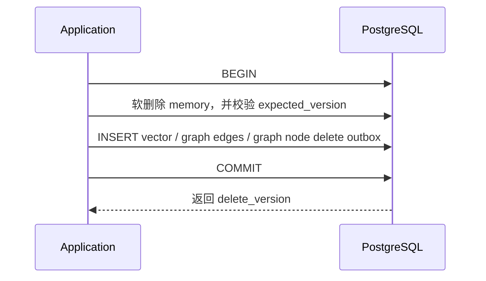

图删除事件通常先删边再删节点；Neo4j 使用 `DETACH DELETE` 时节点删除本身也必须保持幂等。

## 7. 合并方案

合并流程必须从“先改内存、再同步数据库”改成“先生成计划、事务提交、再刷新投影”。

### 7.1 生成合并计划

从 PostgreSQL 一致性快照或带版本的 LongTerm 快照读取候选数据，只计算而不修改共享状态：

```go
type ConsolidationPlan struct {
    Updates []MemoryUpdate
    Deletes []MemoryDelete
}
```

计划中每个对象必须包含读取时的 `expected_version`。

### 7.2 提交合并事务

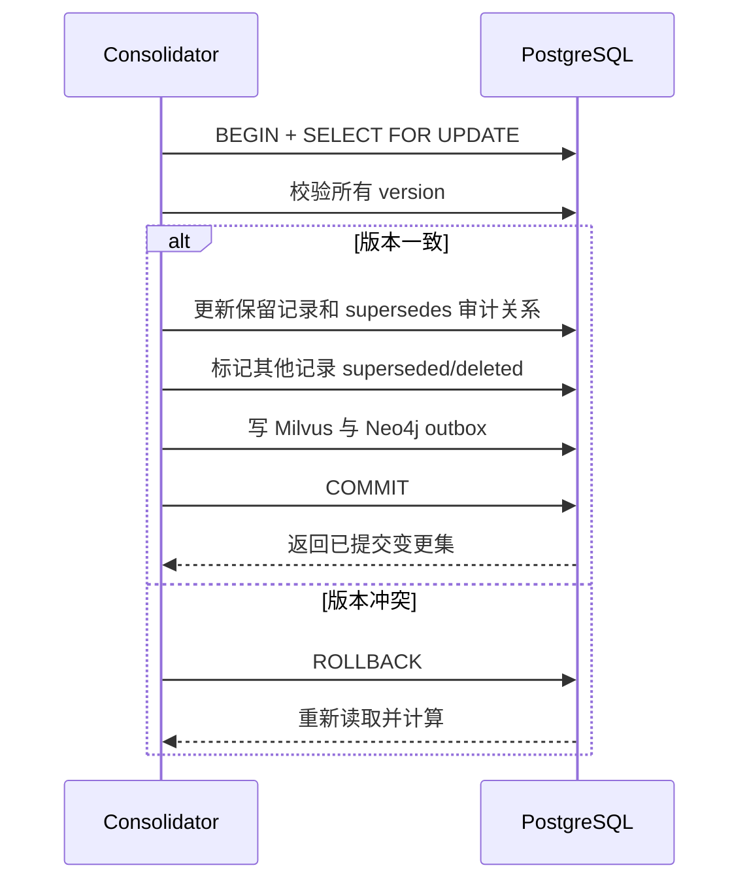

任意版本不一致时回滚整个事务，重新读取并计算计划。去重、合并、衰减和过期淘汰可以在同一批事务中完成，但应限制单批记录数，避免长事务和过多行锁。

事务提交后：

- 当前实例应用已提交的变更集到 LongTerm；
- 应用失败时立即失效对应用户或分片缓存，从 PostgreSQL 重载；
- 不允许用缓存旧值反向覆盖 PostgreSQL。

## 8. Worker 设计

### 8.1 任务领取

多个 worker 可以并行领取任务：

```sql
SELECT id
FROM memory_outbox
WHERE status = 'pending'
  AND available_at <= NOW()
ORDER BY id
FOR UPDATE SKIP LOCKED
LIMIT 100;
```

领取任务时使用一个短事务把状态改为 `processing`，写入 `locked_at` 和 `locked_by`，然后提交。调用 Milvus 或 Neo4j 时不得长期持有 PostgreSQL 行锁。

### 8.2 成功、失败与重试

- 成功：将事件标记为 `processed`，记录 `processed_at`；
- 失败：增加 `attempts`，记录 `last_error`，重新设为 `pending`；
- 重试：采用指数退避并加入随机抖动；
- 死信：超过阈值后标记为 `dead`，保留人工检查和重放能力；
- 锁恢复：定时把超过租约时间的 `processing` 事件重新置为 `pending`；
- 清理：成功事件保留一段审计期后归档或分批删除。

Milvus 和 Neo4j 使用独立 worker pool、并发限制和熔断策略，避免某个目标库故障阻塞另一个目标库。

### 8.3 同一记忆的顺序

不同记忆可以并行，同一 `memory_id` 的事件需要逻辑串行。可采用以下任一方式：

- 按 `memory_id` 哈希到固定 worker 分区；
- 消费前获取以 `memory_id` 为键的 PostgreSQL advisory lock；
- Worker 总是读取该记忆尚未完成的最小版本事件。

即使有顺序控制，目标端仍必须保存并校验版本，因为 worker 崩溃、超时重试和人工重放仍会造成重复或乱序。

## 9. 幂等与乱序保护

Milvus 和 Neo4j 中的每个记忆对象至少保存：

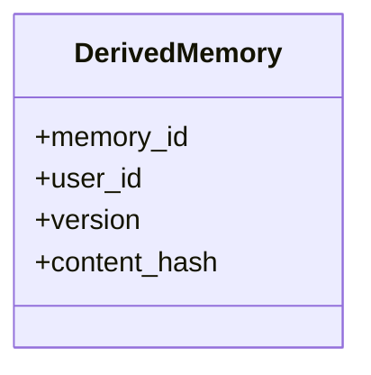

Upsert 规则：

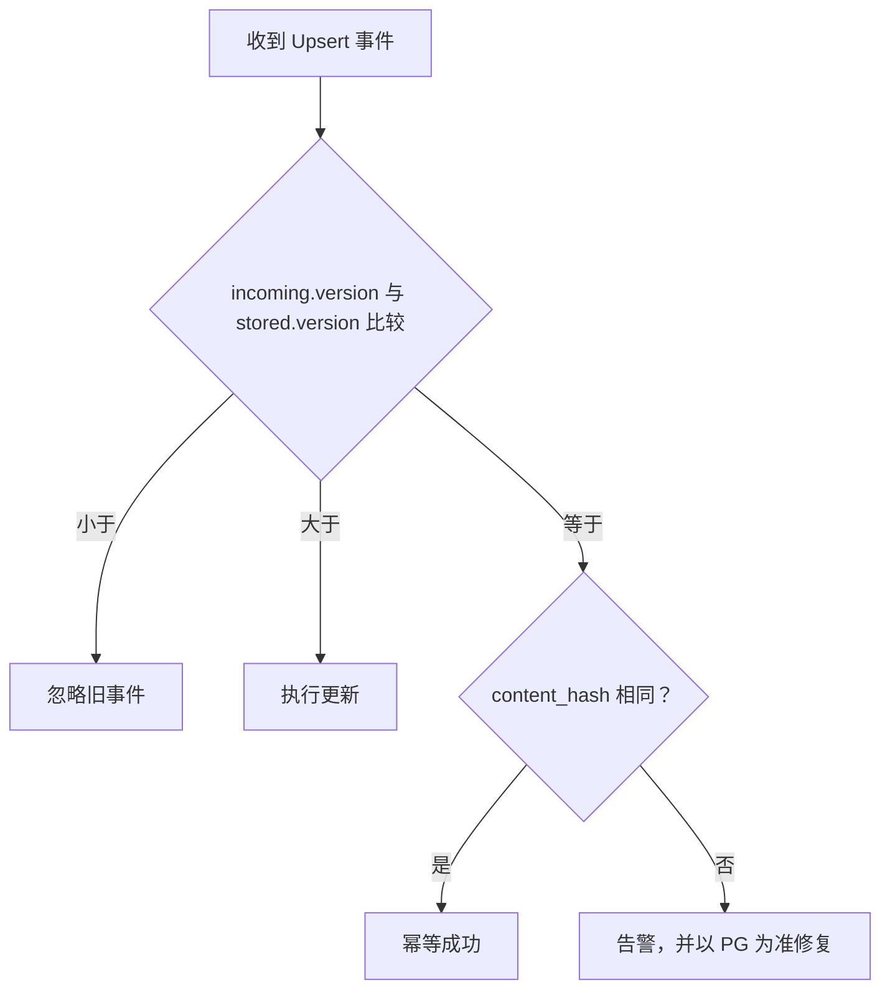

Delete 事件也必须携带删除版本：

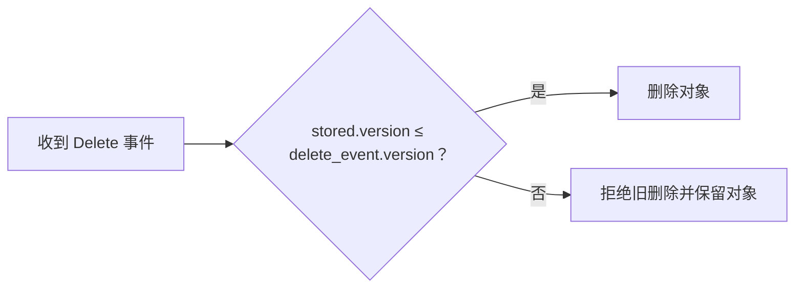

这样可以避免以下错误：

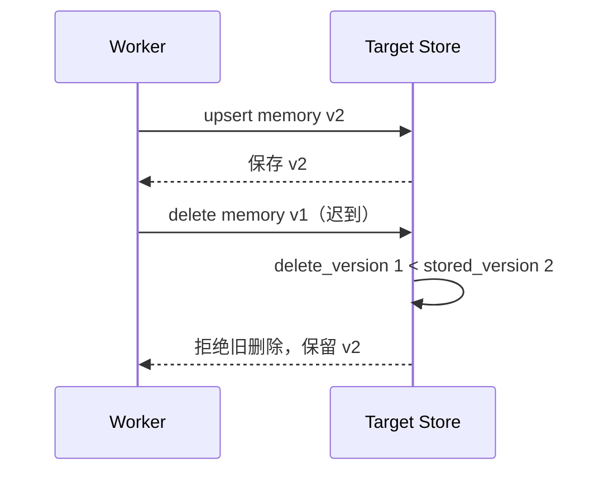

幂等键分为两层：

- `event_id`：识别同一个 outbox 事件的重复执行；
- `memory_id + version + target + operation`：识别同一业务版本产生的等价投影操作。

Neo4j 节点使用 `MERGE (m:Memory {memory_id: $id})`，并根据版本条件设置属性。Milvus 使用稳定的 `memory_id` 作为主键执行 upsert/delete。若 Milvus 无法原子地比较版本，应依靠同一记忆串行消费，并在写入前后校验版本；Reconciler 负责修复极端竞态。

## 10. Reconciliation 对账与修复

Outbox worker 负责实时传播，Reconciler 负责周期性证明并恢复收敛。

### 10.1 对账范围

分别为 Milvus 和 Neo4j 运行对账任务，按 `user_id`、更新时间水位或主键范围分页，避免每次无条件扫描整张大表。系统还应支持低频全量扫描，覆盖水位遗漏和历史数据。

对账器识别三类漂移：

| 漂移类型 | 判断 | 修复动作 |
|---|---|---|
| 缺失 | PG 有有效记录，目标库无对象 | 产生 upsert repair 事件 |
| 陈旧 | ID 相同，但版本或 hash 落后 | 产生 upsert repair 事件 |
| 孤儿 | 目标库存在，PG 不存在或已软删除 | 产生 delete repair 事件 |

Neo4j 还应检查边的两个端点、边类型、边版本和关系 hash，修复悬空边、缺失边及陈旧边。

### 10.2 通过 Outbox 修复

Reconciler 不直接写 Milvus 或 Neo4j，而是把修复动作重新写入 `memory_outbox`，复用正常 worker 的幂等、重试、限流、监控和审计机制。

Repair 事件使用唯一键防止每轮对账反复创建：

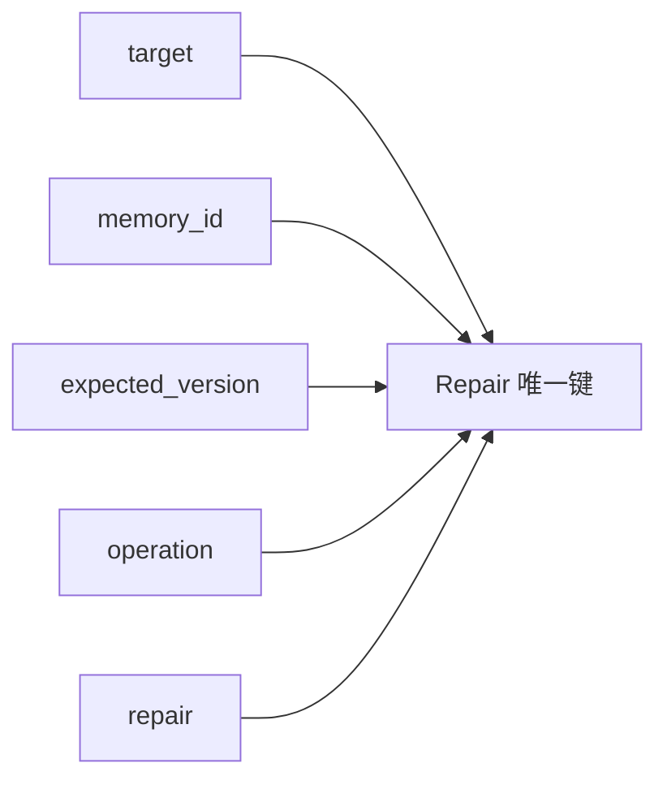

### 10.3 删除墓碑清理

物理清理软删除记录前必须同时满足：

- 删除版本对应的 outbox 已处理或已被更高版本覆盖；
- 最近一次全量 reconciliation 确认所有目标库均不存在该对象；
- 已超过规定的审计与恢复保留期。

## 11. 读一致性与缓存策略

### 11.1 Read-your-writes

PostgreSQL 事务提交成功后，立即将已提交结果应用到当前实例 LongTerm，使同一实例上的后续请求能够看到刚写入的数据。

缓存更新不是事务的一部分：

- 缓存更新成功：正常提供低延迟读取；
- 缓存更新失败：失效对应用户或分片的缓存，从 PostgreSQL 重载；
- 不得因缓存失败回滚或伪装 PostgreSQL 已提交事务失败。

### 11.2 多实例传播

每个实例的 LongTerm 都是本地派生缓存。可由专门的 `ltm_cache` outbox 消费者广播失效通知，实例收到后按需重载。即使通知丢失，也应通过缓存 TTL、版本检查或增量水位同步最终刷新。

### 11.3 查询来源

- 管理、审计、冲突裁决：直接查询 PostgreSQL；
- 普通语义召回：优先 Milvus，允许短暂最终一致延迟；
- 图扩展召回：查询 Neo4j；
- 刚提交但向量尚未投影的短窗口：可将本机 LongTerm 结果与 Milvus 结果合并并按 `memory_id + version` 去重。

## 12. 故障场景与系统行为

| 故障场景 | 系统行为 |
|---|---|
| PG 事务失败 | 记忆和 outbox 一起回滚，无派生变化 |
| PG 提交后进程崩溃 | outbox 保留，其他或重启后的 worker 继续处理 |
| Milvus 暂时不可用 | 向量事件重试，Neo4j worker 不受阻塞 |
| Neo4j 暂时不可用 | 图事件重试，语义向量召回继续可用 |
| Worker 处理成功但来不及确认 | 事件被重复执行，目标端幂等保证结果不变 |
| 事件乱序 | 目标端版本检查拒绝旧版本 |
| Worker 永久失败 | 事件进入 dead，触发告警并允许人工重放 |
| 本机缓存刷新失败 | 失效缓存并从 PG 重载 |
| Outbox 逻辑缺陷或人工改库 | Reconciler 发现并生成 repair 事件 |
| Reconciler 重复发现同一差异 | Repair 唯一键防止任务风暴 |

## 13. 可观测性与运维

至少提供以下指标：

- `memory_outbox_pending_total{target,event_type}`；
- `memory_outbox_oldest_pending_seconds{target}`；
- `memory_outbox_processing_total`；
- `memory_outbox_dead_total{target,event_type}`；
- `memory_outbox_retry_total{target}`；
- `memory_projection_latency_seconds{target}`；
- `memory_reconciliation_mismatch_total{target,type}`；
- `memory_reconciliation_repaired_total{target,type}`；
- `memory_cache_reload_total{reason}`。

关键告警：

- 最老 pending 事件超过目标收敛时间；
- dead 事件数增加；
- 同一目标连续处理失败；
- reconciliation 差异率持续升高；
- 同版本 hash 冲突；
- 缓存版本长期落后 PostgreSQL。

日志必须携带 `event_id`、`memory_id`、`user_id`、`version`、`target`、`attempts` 和 request/trace ID，便于跨组件追踪。

## 14. 分阶段迁移方案

### 阶段一：建立事实源和版本

1. 为 `long_term_memory` 增加 `version`、`updated_at`、`deleted_at`、`content_hash`；
2. 建立 `memory_outbox`；
3. 保留现有读链路，暂不切换 Milvus/Neo4j 写入；
4. 对存量记录回填版本和 hash。

### 阶段二：改造单条写入

1. 新增、修改、删除改成 PG-first；
2. 同事务写 outbox；
3. PG 提交后刷新 LongTerm；
4. 禁止在获得 PG 正式 ID 前创建派生对象。

### 阶段三：上线 worker

1. 上线 Milvus 和 Neo4j 独立 worker；
2. 先以 shadow 模式运行并比较结果；
3. 验证幂等、乱序、重试、锁超时恢复和 dead 重放；
4. 停止旧的直接异步写 Neo4j 路径。

### 阶段四：改造合并

1. 将 Consolidate 拆为纯计算 `Plan` 和事务性 `Apply`；
2. 在 PG 事务中完成更新、软删除、审计链和 outbox；
3. 提交后刷新 LongTerm；
4. 删除旧的“先改内存再同步 PG”流程。

### 阶段五：上线 reconciliation

1. 先运行只读审计，输出缺失、孤儿和陈旧报告；
2. 验证误报率后开启 repair outbox；
3. 建立增量对账和低频全量对账；
4. 最后启用墓碑物理清理。

## 15. 测试与验收标准

### 15.1 事务测试

- 业务更新成功、outbox 插入失败时，整个事务回滚；
- 合并任一步骤失败时，所有记录和事件均不变化；
- 并发更新同一记忆时，仅一个期望版本成功。

### 15.2 Worker 测试

- 同一事件执行两次，目标状态不变；
- v2 先于 v1 到达时，最终保留 v2；
- v1 delete 晚于 v2 upsert 时，不误删 v2；
- 外部调用成功但确认失败时，重试可安全完成；
- worker 崩溃后，过期 processing 任务可重新领取；
- 一个目标库故障时，另一个目标库继续消费。

### 15.3 Reconciliation 测试

- 能识别并修复目标库缺失对象；
- 能识别并删除孤儿对象；
- 能通过 version/hash 修复陈旧对象；
- 能发现并修复 Neo4j 缺失或悬空关系边；
- 多次扫描同一差异不会产生无限 repair 事件。

### 15.4 故障注入测试

在 PG commit 前、commit 后、目标库调用前、调用后、outbox 确认前分别终止进程，验证恢复后所有派生存储最终与 PostgreSQL 收敛。

### 15.5 验收指标

- 不存在已提交业务变更但永久缺失 outbox 的情况；
- 重复和乱序事件不会破坏新版本；
- 正常情况下 99% 的投影在约定时间内完成，例如 5 秒；
- 目标库恢复后，积压可自动清空；
- 全量 reconciliation 完成后，PG 与 Milvus/Neo4j 的有效记录、版本和 hash 差异为零；
- PostgreSQL 始终能够独立恢复 LongTerm、Milvus 和 Neo4j。

## 16. 最终效果

改造前，系统依赖调用顺序和尽力而为的异步 goroutine：一次失败就可能留下永久漂移，进程内状态甚至可能领先于持久化状态。

改造后：

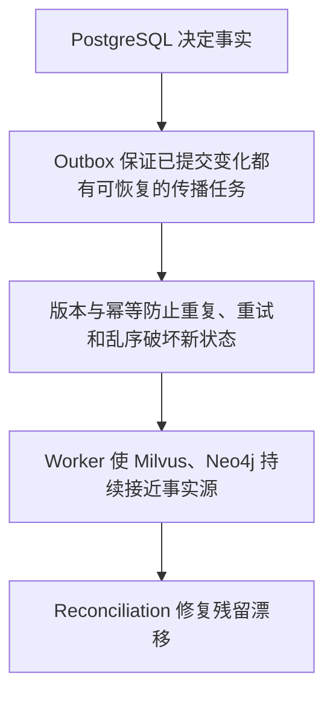

系统不承诺 PostgreSQL、Milvus 和 Neo4j 在每一时刻完全相同，但承诺：只要 PostgreSQL 和目标库最终恢复可用，所有已提交变化都不会丢失，所有派生状态都会在有限时间内收敛到 PostgreSQL 的权威版本。
